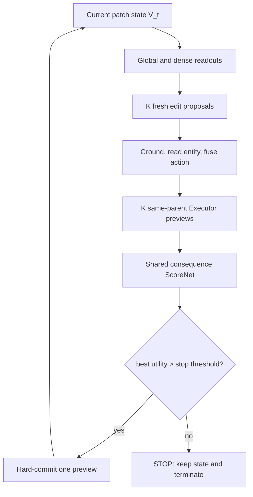

# CIR IAG-SRME — Unified Canonical Architecture and Training Specification V2

**Date:** 2026-09-06  
**Status:** unified source of truth for the current R0 design after integration of the 2026-09-06 implementation decisions; Phase 2/3 extensions remain explicitly deferred  
**Scope:** complete model architecture, forward semantics, backbone-specific retrieval readout, immutable reference-state handling, false-negative-safe in-batch teacher evaluation, training objectives, gradient routing, STOP behavior, anti-collapse machinery, diagnostics, ablations, and long-horizon promotion gates  
**Project:** Composed Image Retrieval (CIR) / IAG-SRME

---

# 0. Purpose and source-precedence rule

This document consolidates the following ten architecture and implementation checkpoints into one implementation-facing specification:

1. `CIR_IAG_SRME_SEQUENTIAL_CLOSED_LOOP_ARCHITECTURE_CANONICAL_SPEC_V1_2026-09-02.md`
2. `CIR_IAG_SRME_SEQUENTIAL_SELECTOR_AND_ANTICOLLAPSE_SUPPLEMENT_V1_2026-09-02.md`
3. `CIR_IAG_SRME_VISUAL_STATE_AND_GLOBAL_CONDITIONED_DYNAMIC_PROPOSAL_SUPPLEMENT_V1_2026-09-02.md`
4. `CIR_IAG_SRME_VLM_BACKBONE_STATE_AND_GLOBAL_READOUT_SUPPLEMENT_V1_2026-09-03.md`
5. `CIR_IAG_SRME_NATIVE_DENSE_COSINE_VISUAL_GROUNDING_SUPPLEMENT_V1_2026-09-03.md`
6. `CIR_IAG_SRME_ENTITY_CONDITIONED_DUAL_GATE_ACTION_FUSION_SUPPLEMENT_V1_2026-09-03.md`
7. `CIR_IAG_SRME_ACTION_CONDITIONED_MASKED_LOCAL_RESIDUAL_EXECUTOR_SUPPLEMENT_V1_2026-09-04.md`
8. `CIR_IAG_SRME_TARGET_JUDGED_CONSEQUENCE_SCORER_AND_LONG_HORIZON_CREDIT_SUPPLEMENT_V1_2026-09-05.md`
9. `CIR_IAG_SRME_STOP_CALIBRATED_SCORENET_HARD_SELECTION_SEMANTIC_AUXILIARIES_AND_DEFERRED_CRITIC_GUIDED_PROPOSER_SUPPLEMENT_V1_2026-09-05.md`
10. `CIR_IAG_SRME_R0_RETRIEVAL_READOUT_DPP_AND_INBATCH_NEGATIVE_IMPLEMENTATION_DECISIONS_SUPPLEMENT_V1_2026-09-06.md`

The tenth checkpoint is integrated directly into the relevant architecture, objective, pseudocode, testing, diagnostic, configuration, and frozen-decision sections below. It is not merely appended as a detached supplement.

The precedence rule is:

\[
\boxed{
\text{newer focused supplement overrides only the interface it explicitly revises; all other prior decisions remain active.}
}
\]

This file removes historical duplication. It distinguishes:

- **canonical R0:** implement now;
- **conditional auxiliary:** activate only in the declared ablation/configuration;
- **diagnostic branch:** measure but do not silently place in the main path;
- **deferred extension:** promote only after its stated failure/promotion gate passes.

## 0.1 Override ledger

| Earlier state | Final unified decision |
|---|---|
| One generic recurrent state at visual block \(L-1\) | Backbone-specific state contract: FG-CLIP2 Track A uses the final native patch interface; FG-CLIP v1 Track B uses the penultimate patch interface. |
| Abstract or generic learned relational grounding | Shared `WhereMLP` + backbone-native dense readout + normalized cosine + shared temperature. |
| Spatial softmax may also be reused as Executor write mask | Read/write split is active: spatial softmax for entity readout, sigmoid support from the same raw cosine for execution. |
| Selector requires candidate SetBlock/self-attention | R0 mainline uses one shared independent consequence ScoreNet; set interaction is an ablation. |
| Hard-forward Straight-Through selection preferred | R0 uses ordinary hard `argmax`/gather with **no Straight-Through** and no soft state mixture. |
| Score is mainly a ranking logit | ScoreNet predicts calibrated one-step marginal retrieval utility relative to keeping the state. |
| STOP absent or optional | STOP is active as the fixed KEEP-STATE utility anchor \(0\), with a validated dead-zone \(\epsilon_{stop}\). |
| Pairwise ranking sufficient | STOP-enabled R0 requires both \(L_{pair}\) and absolute gain calibration \(L_{gain}\). |
| No concept auxiliary | Add instruction-only, set-level, asymmetric \(L_c^{SRME}\), initially at \(t=0\) only. |
| Critic/value ideas loosely possible | Continuation value, terminal RL, and critic-guided Proposer optimization are explicitly deferred and separately gated. |
| Track-B retrieval readout could optionally fuse \(T\) or \(V_0\) directly | Track B is fixed to `RetrievalReadout_B(V_t)`: learned \(q_G\) plus the verified final-block-style global path and retrieval projection; no direct extra \(T\) or \(V_0\) branch. |
| Pseudocode initialized only mutable `V` | Initialize immutable \(V_0\), then evolve a distinct current state \(V=V_0.clone()\). |
| DPP internal scale and external loss weight could both be read as a generic lambda | \(\kappa_{DPP}\) is the internal log-determinant scale; \(\lambda_{DPP}\) is the external total-loss weight. |
| Teacher negative-set source remained open | R0 uses false-negative-safe in-batch target embeddings, identity/relevance-aware masks, and one common sibling pool per parent/timestep. |
| STOP bootstrap risk suggested a possible curriculum | First R0 run keeps the canonical STOP mechanism unchanged; add a curriculum only after measured dead-start evidence. |

## 0.2 Canonical one-sentence definition

> IAG-SRME is a target-free recurrent candidate-action system that repeatedly reads the current latent visual state, generates fresh instruction-grounded edit proposals, previews every candidate consequence from the same parent state, predicts each consequence's marginal retrieval utility relative to keeping the state, hard-commits exactly one sufficiently useful candidate, and terminates when no candidate clears the STOP threshold.

## 0.3 Integrated 2026-09-06 implementation locks

| Audit item | V2 status |
|---|---|
| Track-B RetrievalReadout ambiguity | Resolved: current \(V_t\) is read by learned \(q_G\) through the verified final-block-style path; no direct extra \(T\) or \(V_0\) fusion. |
| STOP bootstrap concern | No new mechanism in first R0 run; diagnose before introducing a curriculum. |
| Ambiguous \(V_0\) lifetime | Resolved: explicitly bind immutable \(V_0\) and evolve a distinct current state. |
| DPP lambda collision | Resolved: internal \(\kappa_{DPP}\), external \(\lambda_{DPP}\). |
| Teacher negative-set source | Resolved: identity/relevance-aware, false-negative-safe in-batch targets shared by current and all sibling queries. |

---

# 1. Problem formulation and non-negotiable causal contract

A CIR sample contains:

- reference image \(x_r\);
- modification instruction \(x_m\);
- training/evaluation target image \(x^*\).

Encode the instruction as contextual token features and a global representation:

\[
T=E_t^{token}(x_m)=[t_1,\ldots,t_L],
\qquad
\bar T=GlobalText(T).
\]

The reference image initializes an immutable per-forward-pass anchor, from which the mutable recurrent state begins:

\[
V_0=StateEncoder(x_r),
\qquad
V\leftarrow V_0.clone(),
\qquad
V_t\in\mathbb R^{N\times D_v}.
\]

Here \(V_0\) always denotes the original reference patch state for that forward pass. The evolving variable \(V\), whose value at timestep \(t\) is \(V_t\), must be updated out of place so recurrent commits never overwrite or alias-mutate \(V_0\). Immutability concerns the stored state value; it does not by itself freeze the upstream backbone or forbid gradients through the computation that produced \(V_0\).

The target is privileged supervision only. It must never enter:

- recurrent state;
- current global/dense readouts;
- Proposal;
- Grounding;
- entity readout;
- Action Fusion;
- Executor;
- ScoreNet;
- STOP;
- ValueNet or actor input;
- any inference-time decision.

The invariant is:

\[
\boxed{
x^*\text{ judges outputs during training but never generates model features or actions.}
}
\]

A target shuffle before an optimizer update may change teacher utilities and retrieval losses, but must not change proposals, grounding, actions, previews, ScoreNet predictions, or STOP decisions.

---

# 2. System-level recurrent computation

For each live sample at timestep \(t\):

\[
\boxed{
V_t
\xrightarrow{\text{read}}
(g_t,D_t)
\xrightarrow{\text{propose}}
E_t
\xrightarrow{\text{ground/read}}
(\Alpha_t^{read},M_t^{exec},H_t)
\xrightarrow{\text{fuse}}
A_t^{act}
\xrightarrow{\text{preview all }K}
(\Delta V_t^{1:K},\widehat V_{t+1}^{1:K})
\xrightarrow{\text{score}}
\widehat u_t^{1:K}.
}
\]

Decision:

\[
\boxed{
\max_k\widehat u_{t,k}\le\epsilon_{stop}
\Rightarrow
STOP
}
\]

otherwise:

\[
\boxed{
k_t^*=\arg\max_k\widehat u_{t,k},
\qquad
V_{t+1}=\widehat V_{t+1}^{(k_t^*)}.
}
\]

After a commit, all state-dependent quantities are recomputed. Old candidate proposals are discarded.



The computational complexity of the live greedy rollout is approximately:

\[
\boxed{O(T_{max}K),}
\]

not \(O(K^{T_{max}})\), because only one recurrent state survives each timestep.

---

# 3. Canonical symbols and tensor contract

Use distinct names for grounding, actions, and effects; do not overload `A_t` in code.

| Symbol | Meaning | Shape |
|---|---|---|
| \(V_0\) | immutable initial reference patch-state anchor for the current forward pass | `[B,N,Dv]` |
| \(V_t\) | persistent current patch state | `[B,N,Dv]` |
| \(T\) | contextual instruction tokens | `[B,L,Dt]` |
| \(\bar T\) | global instruction | `[B,DT]` |
| \(g_t\) | global observation of current state | `[B,Dg]` |
| \(D_t\) | transient native-dense local readout | `[B,N,Dd]` |
| \(Q_{prop}\) | learnable proposal priors | `[K,Dp]` |
| \(E_t\) | dynamic edit candidates | `[B,K,De]` |
| \(R_t^{grd}\) | raw normalized grounding cosine | `[B,K,N]` |
| \(\Alpha_t^{read}\) | spatial-softmax read distributions | `[B,K,N]` |
| \(M_t^{exec}\) | sigmoid execution/write supports | `[B,K,N]` |
| \(H_t\) | current grounded entities | `[B,K,Dv]` |
| \(A_t^{act}\) | entity-conditioned actions | `[B,K,Da]` |
| \(\widetilde{\Delta V}_t\) | raw Executor residuals | `[B,K,N,Dv]` |
| \(\Delta V_t\) | support-masked residuals | `[B,K,N,Dv]` |
| \(\widehat V_{t+1}\) | same-parent candidate next states | `[B,K,N,Dv]` |
| \(q_t\) | target-free retrieval query from \(V_t\); Track B uses `RetrievalReadout_B(V_t)` with no direct \(T/V_0\) branch | `[B,Dq]` |
| \(\Delta q_t\) | task-visible candidate effects | `[B,K,Dq]` |
| \(F_t^{score}\) | consequence features | `[B,K,5d]` |
| \(\widehat u_t\) | predicted marginal utilities | `[B,K]` |
| \(Y\) | in-batch target embeddings used by the detached training judge only | `[B,Dq]` |
| \(P,N\) | identity/relevance-aware positive and negative masks for the teacher | `[B,B]` |
| \(\kappa_{DPP}\) | internal Functional-DPP log-determinant scale | scalar |
| \(\lambda_{DPP}\) | external Functional-DPP coefficient in \(L_{total}\) | scalar |

Recommended initial shared widths where compatible:

\[
d=256,
\qquad
d_x=256.
\]

Exact VLM dimensions must come from the actual checkpoint/interface, not from prose or tensor-shape guesses.

---

# 4. Persistent visual state and backbone-specific readouts

## 4.1 Shared invariant

Only patch tokens are recurrent state:

\[
\boxed{
\text{persistent visual memory}=V_t.
}
\]

CLS/global vectors, dense features, and retrieval queries are readouts, not additional memories:

\[
g_t=GlobalReadout(V_t),
\qquad
D_t=NativeDenseReadout(V_t),
\qquad
q_t=RetrievalReadout(V_t).
\]

They are recomputed after every committed edit. No original/stale CLS or cached global token is carried through the loop.

## 4.2 Immutable initial reference anchor

The reference encoder output must be bound explicitly:

```python
V0 = initial_patch_state(reference)
V = V0.clone()
```

Semantics:

```text
V0 = immutable initial patch representation of the reference image
V  = mutable/logically evolving current recurrent state
```

\(V_0\) may be read later by correspondence or reference-anchored consistency mechanisms, but recurrent commits must never overwrite it. Prefer out-of-place updates:

```python
candidate_V = V[:, None, :, :] + delta_V
V_next = hard_commit_one_candidate(
    current_V=V,
    candidate_V=candidate_V,
    best_idx=best_idx,
    execute_mask=execute_mask,
)
V = V_next
```

The anchor is immutable as a forward-state value. With a trainable backbone, gradients may still flow through the computation that produced \(V_0\); the rule does not silently detach or freeze it.

## 4.3 Track A — FG-CLIP2 Base

| Item | Canonical Track A contract |
|---|---|
| Backbone | FG-CLIP2 Base |
| Vision policy | frozen parameters |
| Project-level `vocab` | frozen; exact code module must be recorded |
| Persistent state | final FG-CLIP2 patch representation at the native head interface |
| State notation | \(V_t=H_L^{patch}\), with exact pre/post-LN status documented |
| Global readout | \(g_t=GlobalHead_{FG2}(V_t)\) |
| Retrieval readout | Track-A native/verified global-head retrieval contract |
| Dense readout | \(D_t=DenseHead_{FG2}(V_t)\) |
| Extra final-block replay | forbidden |

Frozen parameters do not imply a detached recurrent state:

\[
\frac{\partial L}{\partial\theta_{FG2}}=0
\quad\text{while}\quad
\frac{\partial L}{\partial V_t}\ne0
\]

when a downstream loss depends on the readout.

## 4.4 Track B — FG-CLIP v1 Base

| Item | Canonical Track B contract |
|---|---|
| Backbone | FG-CLIP Base |
| Vision policy | full training |
| Persistent state | penultimate patch representation |
| State notation | \(V_t\approx H_{L-1}^{patch}\) |
| CLS policy | not recurrent |
| Global query | one learned \(q_G\), supplying the missing/non-recurrent CLS-like query role |
| Global readout | \(g_t=GlobalReadout_B(V_t;q_G)\), using current \(V_t\) as keys/values and the verified final-block-style path |
| Retrieval query | \(q_t=RetrieveProject(g_t)\), or \(q_t=g_t\) if \(g_t\) already satisfies the verified projected/normalized retrieval contract |
| Direct retrieval conditioning | no extra \(T\) branch and no extra \(V_0\) branch in R0 |
| Dense readout | native `forward_without_attn → post_layernorm → visual_projection` path |

Conceptually:

\[
q_G
\xrightarrow[K,V=V_t]{CrossAttention}
r_t
\xrightarrow{\text{verified final-block-style FFN/LN/projection}}
g_t
\xrightarrow{\text{declared retrieval projection/normalization}}
q_t.
\]

\(q_G\) supplies the global query role, while \(V_t\) supplies the current edited patch content. The Track B native dense path begins from `hidden_states[-2]` and must preserve the official FG-CLIP v1 local readout order.

Text is not absent from retrieval: it changes Proposal, Grounding, Fusion, and Executor, which changes \(V_t\), and the readout observes that changed state. The prohibition is only against an additional direct text shortcut inside `RetrievalReadout_B`. Likewise, \(V_0\) remains legal for separately declared reference mechanisms but is not fused directly into the Track-B R0 retrieval query.

## 4.5 Mandatory interface parity

Before recurrent training:

- reconstruct native global/dense/retrieval outputs from exposed \(V_0\);
- compare against the official backbone APIs;
- for Track B, verify the exact \(q_G\) source/initialization and final-block-style machinery;
- verify that current, candidate, and terminal states use the same retrieval-readout function and parameters;
- verify vectorized and loop candidate readouts agree within tolerance;
- record exact checkpoint/revision, preprocessing, block index, special-token policy, pre/post-LN status, projection/normalization status, and max/mean numerical error;
- do not proceed on shape compatibility alone.

Do not mix Track A and Track B state/readout contracts implicitly. The Track-B lock does not authorize replaying an extra final block in Track A.

---

# 5. Dynamic state-conditioned Proposal

## 5.1 Semantic responsibility

The Proposal answers:

\[
\boxed{\text{WHAT COULD I DO NOW?}}
\]

The \(K\) learnable queries are proposal capacity, not fixed semantic slots:

\[
Q_{prop}=[q_1,\ldots,q_K].
\]

Candidate index must not be hard-coded as color, length, removal, shape, or an ordered semantic step.

## 5.2 Global desired-vs-current context

Project global text and current global vision:

\[
\widetilde T=W_T\bar T,
\qquad
\widetilde g_t=W_g g_t.
\]

Build one shared context:

\[
\boxed{
c_t=MLP_c([
\widetilde T;
\widetilde g_t;
\widetilde T\odot\widetilde g_t;
\widetilde T-\widetilde g_t
]).
}
\]

The product and difference are learnable compatibility/mismatch features. They must not be claimed to equal the completed and remaining edits exactly.

## 5.3 Condition all proposal priors with shared parameters

For each candidate:

\[
\boxed{
\widehat q_{t,k}
=LN\left(
q_k+MLP_q([q_k;c_t;q_k\odot c_t])
\right).
}
\]

The same \(MLP_q\), \(W_T\), and \(W_g\) are used for every candidate.

## 5.4 Acquire token-level edit content

\[
\boxed{
e_t^k
=CrossAttn(Q=\widehat q_{t,k},K=T,V=T).
}
\]

R0 has no direct conditioned-query/global residual into the edit output:

\[
e_t^k\ne
\widehat q_{t,k}+CrossAttn(\widehat q_{t,k},T,T).
\]

The conditioned query controls which text evidence is read; the semantic value/content path comes from token-level instruction features.

## 5.5 Proposal firewall and invariants

Proposal may see \(g_t\), but not patch tokens \(V_t\) or \(D_t\). The Grounder is the first patch-level visual interaction for a candidate.

All candidates are generated in parallel from the same \((T,\bar T,g_t,c_t)\). There is no candidate recurrence \(e_t^{k-1}\to e_t^k\), no private per-index conditioner, no candidate-ID embedding, and no Proposal self-attention in R0.

---

# 6. Native-dense current-state grounding

## 6.1 Semantic responsibility

The Grounder answers:

\[
\boxed{\text{WHERE SHOULD THIS EDIT OPERATE NOW?}}
\]

It grounds the dynamic edit against the current state, not only the original reference:

\[
\alpha_t^k=Ground(e_t^k,V_t).
\]

## 6.2 Shared WHERE adapter

Use one small network shared over samples, timesteps, and candidates:

\[
\boxed{
q_{t,k}^{where}
=W_2\phi(W_1LN(e_t^k)),
}
\]

with GELU or SiLU and output dimension \(D_d\). A single linear projection is the required lower-capacity baseline.

## 6.3 Native dense locator space

\[
D_t=NativeDenseReadout(V_t).
\]

- Track A uses the verified FG-CLIP2 native dense head from its final patch interface.
- Track B uses the verified FG-CLIP v1 native dense path from its penultimate patch interface.

Dense features answer WHERE. They are transient and are not the recurrent state.

## 6.4 Normalized cosine evidence

Normalize both sides:

\[
\bar q_{t,k}=\frac{q_{t,k}^{where}}{\|q_{t,k}^{where}\|_2+\epsilon},
\qquad
\bar d_{t,j}=\frac{D_{t,j}}{\|D_{t,j}\|_2+\epsilon}.
\]

Raw grounding evidence:

\[
\boxed{
r_{t,k,j}^{grd}=\bar q_{t,k}^{\top}\bar d_{t,j}.
}
\]

Use a shared positive clamped read scale:

\[
\lambda_{read}=Clamp(e^{\rho_{read}},\lambda_{min},\lambda_{max}).
\]

## 6.5 Read distribution

Every candidate normalizes independently over spatial positions only:

\[
\boxed{
\alpha_{t,k,:}^{read}
=Softmax_N(\lambda_{read}r_{t,k,:}^{grd}).
}
\]

Thus:

\[
\sum_j\alpha_{t,k,j}^{read}=1,
\qquad
\text{but no constraint is imposed on }\sum_k\alpha_{t,k,j}^{read}.
\]

## 6.6 Execution support

R0 uses a separate variable-area write support derived from the same raw evidence:

\[
\boxed{
m_{t,k,j}^{exec}
=\sigma\left(
\lambda_{exec}(r_{t,k,j}^{grd}-b_{exec})
\right),
}
\]

where \(\lambda_{exec}>0\) is shared/clamped and \(b_{exec}\) is one shared threshold. There is no spatial sum-to-one constraint.

This makes the semantics explicit:

\[
\boxed{
\alpha^{read}=\text{relative unit-mass entity pooling},
\qquad
M^{exec}=\text{absolute patch-wise write permission}.
}
\]

Do not introduce per-candidate temperature, threshold, candidate-axis softmax, Sinkhorn ownership, or grounding orthogonality.

## 6.7 Candidate overlap is legal

Two useful actions may target the same region:

\[
\alpha_t^i\approx\alpha_t^j
\quad\text{and}\quad
M_t^{i,exec}\approx M_t^{j,exec}
\]

while their actual effects differ. Spatial overlap is not candidate collapse; functional consequence similarity is the authoritative test.

---

# 7. Current entity readout and action fusion

## 7.1 Current entity readout

Read the actual mutable state, not the dense locator representation:

\[
\boxed{
h_t^k
=\sum_j\alpha_{t,k,j}^{read}V_{t,j}.
}
\]

Batch form:

\[
H_t=\Alpha_t^{read}V_t.
\]

This answers:

\[
\boxed{\text{WHAT IS CURRENTLY THERE?}}
\]

## 7.2 Bounded independent dual-gate Action Fusion

R0 requires compatible equal dimensions:

\[
D_e=D_h=D_a=D.
\]

Do not silently insert alignment projections when dimensions differ; that must be a named variant.

For each candidate, concatenate in the fixed order \([h;e]\):

\[
z_t^k=[h_t^k;e_t^k].
\]

One shared MLP produces two independent bounded feature-wise gates:

\[
\boxed{
[\gamma_{t,k}^{fuse};\beta_{t,k}^{fuse}]
=\sigma\left(
W_2^{fuse}LeakyReLU(W_1^{fuse}z_t^k+b_1)+b_2
\right).
}
\]

Architecture:

```text
2D → D → 2D
LeakyReLU, then Sigmoid
```

Action:

\[
\boxed{
a_t^k
=\gamma_{t,k}^{fuse}\odot h_t^k
+\beta_{t,k}^{fuse}\odot e_t^k.
}
\]

The gates are independent:

\[
\beta^{fuse}\not\equiv1-\gamma^{fuse}.
\]

Both current-entity and desired-edit evidence may be strong in the same dimension.

R0 has no pre-fusion projection, pre-LN, post-LN, dropout, candidate interaction, candidate-specific parameters, candidate-ID input, or action-history input. OFFSET-style bounded gating is mainline; ENCODER-style unbounded dual affine and TEMA-style complementary gating are ablations.

---

# 8. Action-conditioned masked local residual Executor

## 8.1 Semantic responsibility

The Executor answers:

\[
\boxed{
\text{WHAT CURRENT PATCH-STATE TRANSITION WOULD THIS ACTION CAUSE?}
}
\]

Action decides HOW to generate a residual. Grounding-derived support decides WHERE to write it. The old state provides the preservation base.

## 8.2 State workspace

Project the current state once:

\[
\boxed{X_t=W_{\downarrow}V_t,}
\]

where \(W_{\downarrow}:\mathbb R^{D_v}\to\mathbb R^{d_x}\) and \(d_x=256\) is the recommended start.

## 8.3 Action conditioner

Use one shared conditioner:

\[
\boxed{
[\gamma_{t,k}^{exec};\beta_{t,k}^{exec}]
=ActionMLP(LN(a_t^k)).
}
\]

Recommended architecture:

```text
LayerNorm(Da)
→ Linear(Da, 2dx)
→ SiLU
→ Linear(2dx, 2dx)
→ split gamma_exec, beta_exec
```

Unlike fusion gates, Executor modulation parameters are unbounded:

\[
\gamma^{exec},\beta^{exec}\in\mathbb R^{d_x}.
\]

No sigmoid is applied.

## 8.4 AdaLN-style state modulation

\[
\boxed{
U_{t,j}^k
=(1+\gamma_{t,k}^{exec})\odot LN(X_{t,j})
+\beta_{t,k}^{exec}.
}
\]

## 8.5 Local dynamics

Reshape patch tokens using the explicit grid \(N=H_pW_p\). Apply one residual depthwise 3×3 mixer:

\[
\boxed{
C_t^k=U_t^k+DWConv_{3\times3}(U_t^k).
}
\]

Then one residual channel FFN:

\[
\boxed{
R_t^k=C_t^k+FFN(LN(C_t^k)),
}
\]

with expansion \(d_x\to4d_x\to d_x\) and GELU.

Local context is read before support masking, so a written patch may inspect neighbors while final writes remain support-controlled.

## 8.6 Signed residual and state update

Project back without an output activation:

\[
\boxed{
\widetilde{\Delta V}_t^k=W_{\uparrow}R_t^k.
}
\]

Apply scalar support over channels:

\[
\boxed{
\Delta V_t^k
=M_t^{k,exec}[...,None]\odot\widetilde{\Delta V}_t^k.
}
\]

Candidate next state:

\[
\boxed{
\widehat V_{t+1}^{(k)}=V_t+\Delta V_t^k.
}
\]

All \(K\) previews use the same immutable parent \(V_t\).

## 8.7 Initialization

Start near exact identity:

\[
W_{\uparrow}=0,
\qquad
b_{\uparrow}=0,
\]

and zero-initialize the last ActionMLP layer so initially:

\[
\gamma^{exec}\approx0,
\qquad
\beta^{exec}\approx0,
\qquad
\widehat V_{t+1}^{(k)}\approx V_t.
\]

This may delay deeper gradients at the earliest update. If it becomes a measured dead-start, a tiny nonzero \(W_{\uparrow}\) initialization is an explicit ablation, not a silent change.

## 8.8 Explicit R0 exclusions

R0 has no:

- \(\eta\) residual gate;
- six-parameter AdaLN block;
- global/self-attention Executor;
- candidate-specific Executor;
- candidate-ID/private channel;
- action-history input;
- target input;
- direct full-state decoder;
- mandatory post-update normalization;
- residual diversity loss;
- state reconstruction or target-patch reconstruction;
- AC-LAM residual/sequence-composition loss;
- stochastic latent sampling;
- dropout.

The identity:

\[
V_2-V_0=\Delta V_0+\Delta V_1
\]

is already created by additive updates, so penalizing it as a “composition loss” would be tautological.

---

# 9. Retrieval-visible candidate consequence

## 9.1 One target-free function per backbone track

Current, candidate, and terminal states must use the same exact retrieval-readout function and parameters within a run. The target is never an input.

For Track B, the previously generic interface is now fixed:

\[
\boxed{
q_t=RetrievalReadout_B(V_t)
=RetrieveProject(GlobalReadout_B(V_t;q_G)).
}
\]

There is no direct extra \(T\) or \(V_0\) fusion inside this Track-B R0 readout. For Track A, keep its own verified native FG-CLIP2 global-head retrieval contract; the Track-B final-block replay rule does not apply.

## 9.2 Current and sibling-preview queries

For the live parent:

\[
\boxed{
q_t=RetrievalReadout_B(V_t).
}
\]

For each same-parent preview:

\[
\boxed{
\widehat q_{t+1}^{(k)}
=RetrievalReadout_B(\widehat V_{t+1}^{(k)}).
}
\]

Every sibling uses the same \(q_G\), final-block-style readout, retrieval projection, and normalization convention. Candidate-specific readout heads are forbidden.

## 9.3 Functional candidate effect

\[
\boxed{
\Delta q_t^k
=\widehat q_{t+1}^{(k)}-q_t.
}
\]

This is the authoritative candidate-effect descriptor for Functional DPP and functional-collapse analysis. Differences in raw edits, actions, grounding masks, or residual maps are insufficient if they produce the same \(\Delta q\).

## 9.4 Terminal query

When a sample stops or reaches \(T_{max}\):

\[
\boxed{
q_{terminal}=RetrievalReadout_B(V_{terminal}).
}
\]

Recompute it from the actual terminal state. A cached query may be reused only when it is mathematically the exact query of an unchanged KEEP-STATE/STOP state.

## 9.5 Semantic pseudocode for Track B

```python
class TrackBRetrievalReadout(nn.Module):
    def __init__(self, final_block_readout, q_G, visual_projection, normalizer):
        super().__init__()
        self.final_block_readout = final_block_readout
        self.q_G = q_G
        self.visual_projection = visual_projection
        self.normalizer = normalizer

    def forward(self, V_t):
        # V_t: [..., N, Dv], current penultimate patch state
        g_t = self.final_block_readout(
            query=self.q_G,
            key=V_t,
            value=V_t,
        )
        q_t = self.visual_projection(g_t)
        q_t = self.normalizer(q_t)  # only if part of the declared contract
        return q_t

q_now = retrieval_readout_B(V_live)          # [B_live,Dq]
q_candidates = retrieval_readout_B(
    candidate_V
)                                               # [B_live,K,Dq]
```

The exact native call signature is implementation-specific; the pseudocode fixes semantics. Flattened/vectorized and explicit-loop implementations must agree numerically within tolerance.

---

# 10. Consequence feature builder and calibrated ScoreNet

## 10.1 ScoreNet responsibility

ScoreNet answers:

\[
\boxed{
\text{Is this model-predicted consequence useful from the current state?}
}
\]

It is one shared network across all candidates and timesteps. R0 has no candidate-specific score head, candidate-index embedding, or required candidate SetBlock.

## 10.2 Five-part feature

Let the common scorer width be \(d=256\).

Current task context:

\[
\boxed{
c_t^{score}=LN(W_g^{score}g_t+W_T^{score}\bar T).
}
\]

Candidate intention:

\[
\boxed{
\widetilde a_{t,k}=W_a^{score}a_t^k.
}
\]

Local consequence summary should mean a support-normalized mean of the Executor's actual write:

\[
\boxed{
\bar\Delta_{t,k}^{local}
=
\frac{
\sum_j\Delta V_{t,k,j}
}{
\sum_jm_{t,k,j}^{exec}+\epsilon
}
=
\frac{
\sum_jm_{t,k,j}^{exec}\widetilde{\Delta V}_{t,k,j}
}{
\sum_jm_{t,k,j}^{exec}+\epsilon
}.
}
\]

Then:

\[
\boxed{
d_{t,k}^{local}=W_d\bar\Delta_{t,k}^{local}.
}
\]

This notation deliberately avoids multiplying the already-masked \(\Delta V\) by \(m^{exec}\) a second time. A literal \(m^{exec}\Delta V\) implementation would apply \(m^2\) and must be treated as a separately declared variant.

Global consequence:

\[
\widehat g_{t+1}^k=GlobalReadout(\widehat V_{t+1}^{(k)}),
\]

\[
\boxed{
d_{t,k}^{global}
=W_\delta(\widehat g_{t+1}^k-g_t).
}
\]

Intent/effect compatibility:

\[
\boxed{
z_{t,k}^{compat}
=\widetilde a_{t,k}\odot d_{t,k}^{global}.
}
\]

Full feature:

\[
\boxed{
f_{t,k}
=[
c_t^{score};
\widetilde a_{t,k};
d_{t,k}^{local};
d_{t,k}^{global};
z_{t,k}^{compat}
]
\in\mathbb R^{5d}.
}
\]

## 10.3 ScoreNet architecture

For \(d=256\):

```text
1280
→ LayerNorm
→ Linear(1280, 512)
→ GELU
→ Dropout(0.1)
→ Linear(512, 256)
→ GELU
→ Dropout(0.1)
→ Linear(256, 1)
```

Output semantics:

\[
\boxed{
\widehat u_{t,k}=ScoreNet(f_{t,k})\approx u_{t,k}^*,
}
\]

where utility is measured relative to keeping \(V_t\).

## 10.4 Candidate-set symmetry

The same feature builder and ScoreNet are applied independently to each candidate. Therefore permuting candidates must only permute outputs:

\[
\boxed{
ScoreNet(P_KF_t)=P_KScoreNet(F_t).
}
\]

The earlier random-candidate-permutation mechanism may remain enabled as a defensive training/plumbing check, but every candidate-indexed tensor and teacher label must receive the same permutation. Equivariance must hold even without relying on that augmentation.

Set-level self-attention is a later ablation only if strong oracle candidate differences exist but the independent scorer fails specifically on duplicate/relative competition.

---

# 11. Training-only target judge and ScoreNet supervision

## 11.1 Frozen R0 negative policy

The training-only target judge uses target embeddings from the same training batch as its evaluator pool:

```text
positive(s) = batch target entries relevant to parent sample i
negative(s) = valid batch target entries that are not positives for i
```

Ordinary R0 training does not require an external random gallery pool, hard-negative miner, FIFO memory bank, cross-batch cache, or a fixed negative count \(H\). The valid negative count is data-dependent:

\[
|\mathcal N_i|
=
\text{number of valid in-batch target entries/identities not positive for }i.
\]

## 11.2 False-negative-safe identity and relevance masks

The trainer must expose a stable dataset/gallery target identity, such as `target_gallery_id`. Batch row index, tensor position, file order, or candidate index is not a target identity. In particular, the shortcut:

```python
negative_mask[i, j] = (j != i)  # invalid as a general rule
```

is forbidden because different rows may share one valid target.

Define:

\[
P_{ij}=1
\quad\Longleftrightarrow\quad
\text{batch target }j\text{ is relevant for parent }i,
\]

\[
\boxed{
N_{ij}=Valid_j\land\neg P_{ij}.
}
\]

The hard safety invariant is:

\[
\boxed{
P_{ij}=1\Rightarrow N_{ij}=0.
}
\]

At minimum, exact duplicate target identities must never become negatives. If the dataset defines multiple valid positives, \(P\) must represent that relevance relation instead of assuming only a diagonal positive.

When identical targets repeat in a batch, either:

1. retain repeated entries under the positive mask; or
2. deduplicate identical target IDs before constructing the evaluator pool.

Both are legal if declared, consistent within the run, and logged. The non-negotiable rule is that a valid positive never appears in the negative set.

Example without duplicates:

```text
target IDs for the batch = [11, 24, 35, 48]
parent 0 positives       = [11]
parent 0 negatives       = [24, 35, 48]
```

Example with duplicates:

```text
target IDs for the batch = [11, 24, 11, 48]
parent 0 relevant ID     = 11
row 2                    = positive-equivalent, never negative
valid negative IDs       = [24, 48]
```

## 11.3 Common sibling evaluator and marginal utility

For parent sample \(i\) at timestep \(t\), build \((\mathcal P_i,\mathcal N_i)\) once, then reuse them for the current query and every sibling preview:

\[
\left(
q_{i,t},
\widehat q_{i,t+1}^{(1)},
\ldots,
\widehat q_{i,t+1}^{(K)}
\right)
\quad\text{share exactly the same}\quad
(\mathcal P_i,\mathcal N_i).
\]

They must also share the same query/target normalization, similarity \(s\), retrieval temperature \(\tau_r\), and numerical precision convention. Otherwise a loss difference could be caused by a changed evaluator pool instead of a changed candidate consequence.

Let:

\[
\boxed{
\ell_i(q)
=-
\log
\frac{
\sum_{j\in\mathcal P_i}\exp(s(q,y_j)/\tau_r)
}{
\sum_{j\in\mathcal P_i\cup\mathcal N_i}\exp(s(q,y_j)/\tau_r)
}.
}
\]

Teacher utility:

\[
\boxed{
u_{i,t,k}^{*}
=sg\left[
\ell_i(q_{i,t})
-
\ell_i(\widehat q_{i,t+1}^{(k)})
\right].
}
\]

Interpretation:

- \(u^*>0\): better than KEEP STATE;
- \(u^*\approx0\): neutral;
- \(u^*<0\): harmful under the declared evaluator.

For example, if the current loss is \(1.40\) and four candidate losses are \(0.90,1.10,1.80,1.30\), their utilities are \(+0.50,+0.30,-0.40,+0.10\). The intended ordering is:

\[
A>B>D>STOP(0)>C,
\]

subject to the declared confidence and dead-zone rules.

If no valid negative remains for a parent after masking, do not fabricate a negative. Mark that parent-step teacher row invalid, exclude it from the normalized ScoreNet losses, and count the event in diagnostics.

The target judge has no learned parameters and runs under `no_grad`/stop-gradient semantics. Target embeddings, masks, and utilities remain trainer-only and never become live features of Proposal, Grounder, Fusion, Executor, ScoreNet, or inference-time STOP.

Use FP32 for target/query similarity and `logsumexp` arithmetic even when the main model uses BF16/FP16.

Semantic pseudocode:

```python
with torch.no_grad():
    target_emb = retrieval_normalize(target_encoder(target_images))

positive_mask = build_positive_mask(
    target_ids=target_ids,
    dataset_relevance=optional_relevance,
)                                                   # [B,B], bool
valid_target_mask = build_valid_target_mask(...)   # [B], bool
negative_mask = valid_target_mask[None, :] & (~positive_mask)

assert not torch.any(positive_mask & negative_mask)

live_idx = alive.nonzero(as_tuple=False).squeeze(-1)
pos_live = positive_mask[live_idx]
neg_live = negative_mask[live_idx]
valid_teacher_row = neg_live.any(dim=-1)

with torch.no_grad():
    loss_now = teacher_retrieval_loss(
        q_now.float(),
        target_emb.float(),
        positive_mask=pos_live,
        negative_mask=neg_live,
        temperature=tau_r,
    )                                               # [B_live]
    loss_candidates = teacher_retrieval_loss(
        q_candidates.float(),
        target_emb.float(),
        positive_mask=pos_live,
        negative_mask=neg_live,
        temperature=tau_r,
    )                                               # [B_live,K]
    teacher_utility = loss_now[:, None] - loss_candidates
```

The masks are parent/sample masks broadcast over \(K\), never candidate-specific masks. Candidate permutation must only permute teacher utilities; it must not change the evaluator pool.

## 11.4 Confidence-weighted pairwise ranking

For every candidate pair \((i,j)\):

\[
\Delta u_{ij}=u_i^*-u_j^*,
\qquad
y_{ij}=sign(\Delta u_{ij}).
\]

Ignore or strongly down-weight ambiguous pairs when:

\[
|\Delta u_{ij}|<\epsilon_{pair}.
\]

A valid confidence weight is:

\[
\boxed{
w_{ij}=1-\exp(-|\Delta u_{ij}|/\tau_w).
}
\]

Use the detached-input scorer call:

\[
\widetilde u_{t,k}=ScoreNet(sg(f_{t,k})).
\]

Pair loss:

\[
\boxed{
L_{pair}^{ij}
=-w_{ij}\log\sigma\left(
\frac{y_{ij}(\widetilde u_i-\widetilde u_j)}{\tau_{pair}}
\right).
}
\]

For \(K=4\), all six pairs can be evaluated cheaply.

A separately declared robustness experiment may require pair ordering to agree under two independently sampled evaluator pools before treating the label as high-confidence. This is not the ordinary R0 in-batch policy; candidate previews need not be recomputed for the diagnostic.

## 11.5 Absolute gain calibration

STOP requires a meaningful zero. Therefore pairwise ordering alone is insufficient.

Over all live candidate rows whose teacher pool contains at least one valid negative:

\[
\boxed{
L_{gain}
=\frac1{N_{valid}}
\sum_{(b,t,k)\in\mathcal I_{teacher\text{-}valid}}
Huber(\widetilde u_{b,t,k},u_{b,t,k}^*).
}
\]

Pairwise and gain losses must use the same teacher-valid row mask; empty-negative rows contribute neither labels nor normalization count.

Do not batch-center the teacher utilities while retaining zero as the KEEP-STATE anchor. A declared positive rescaling preserves zero but changes Huber and STOP threshold units.

The active ScoreNet loss is:

\[
\boxed{
L_{score}
=\lambda_{pair}L_{pair}
+\lambda_{gain}L_{gain}.
}
\]

An additional sign classifier is not R0. Test it only if ranking and regression are good overall but decisions near utility zero remain poor.

---

# 12. STOP and hard discrete state selection

## 12.1 KEEP-STATE anchor

STOP is not produced by Proposal and has no learned embedding or StopNet.

Define:

\[
\boxed{
\widehat V_{t+1}^{STOP}=V_t.
}
\]

Therefore:

\[
\boxed{
u_{STOP}^{*}=\ell(q_t)-\ell(q_t)=0.
}
\]

## 12.2 Decision rule

For each live sample:

\[
m_t=\max_k\widehat u_{t,k}.
\]

Then:

\[
\boxed{
m_t\le\epsilon_{stop}
\Rightarrow
STOP,
}
\]

otherwise:

\[
\boxed{
k_t^*=\arg\max_k\widehat u_{t,k},
\qquad
V_{t+1}=Gather_K(\widehat V_{t+1},k_t^*).
}
\]

\(\epsilon_{stop}\ge0\) is a validation-chosen dead-zone/implicit step cost that suppresses tiny positive prediction noise. Select it from the quality/compute trade-off, false-STOP rate, false-EXECUTE rate, retrieval performance, and executed-step distribution.

## 12.3 STOP is terminal

Once a sample stops:

- keep its current state exactly;
- mark it non-live;
- do not create later state transitions;
- do not accumulate later live-candidate losses for it;
- evaluate final retrieval from the state where it stopped.

\(T_{max}\) is only a maximum horizon.

## 12.4 Hard selection, no Straight-Through

R0 uses ordinary hard `argmax` and gather:

\[
\boxed{
\text{one committed branch; no ST; no Gumbel-ST; no candidate-state averaging.}
}
\]

Hard selection does not mean a fixed candidate identity. Fresh candidates and their scores are recomputed at every state, so the winning index may change across samples and timesteps.

The selected preview remains differentiable with respect to its own state/action/transition tensors after gather. The discrete index is not differentiated.

Consequences:

- terminal retrieval trains the executed recurrent path;
- terminal retrieval does not train ScoreNet through `argmax` in R0;
- unselected sibling transitions do not receive the selected path's direct terminal gradient;
- ScoreNet learns from \(L_{pair}+L_{gain}\);
- all-candidate auxiliaries may train non-selected candidates without making every branch imitate the target.

## 12.5 R0 bootstrap policy

The following is a plausible early-training risk:

```text
near-identity Executor initialization
    → sibling previews initially resemble V_t
    → teacher marginal utilities may cluster near zero
    → an uncalibrated ScoreNet could predict excessive early STOP
```

It is a risk hypothesis, not yet a measured failure. Therefore the first R0 implementation adds no STOP warmup or curriculum:

\[
\boxed{
\text{train the current zero-anchor STOP system first; intervene only after measured dead-start evidence.}
}
\]

At minimum monitor:

- STOP rate at \(t=0\) and by timestep/epoch;
- executed-depth histogram;
- predicted and teacher best-utility histograms by timestep;
- predicted STOP/continue disagreement against the teacher sign;
- fraction of parents whose candidate utilities are all near zero;
- early Executor residual and \(\Delta q\) norms;
- terminal retrieval quality by stopping depth.

No intervention threshold is frozen here. If a genuine dead-start is measured, separately test delaying STOP, pre-calibrating ScoreNet, forcing at least one early action, or changing initialization. Any such choice is a new named experiment, not a silent change to canonical R0.

---

# 13. Semantic, relation, correspondence, and functional anti-collapse branches

These branches solve different failures and must not be conflated.

## 13.1 Instruction-only concept coverage \(L_c^{SRME}\)

Build a semantic concept vocabulary \(\mathcal M\) from the training split only, using a versioned parser/normalization policy. Candidate concepts come from the instruction, never the target image.

Recommended frozen prototype:

\[
w_c=sg(TextConceptEncoder(c)).
\]

Candidate-to-concept score:

\[
z_{t,k}=Norm(W_ce_t^k),
\]

\[
\boxed{
r_{t,k,c}
=\frac{z_{t,k}^{\top}Norm(w_c)}{\tau_{concept}}.
}
\]

Pool over candidates before applying the instruction-level label:

\[
\boxed{
r_{t,c}^{set}
=\tau_{mil}
\log\sum_{k=1}^K
\exp(r_{t,k,c}/\tau_{mil}),
\qquad
p_{t,c}=\sigma(r_{t,c}^{set}).
}
\]

Do not supervise every candidate with the full instruction concept vector; that would encourage semantic clones.

For positive instruction concepts \(P\) and remaining valid vocabulary entries \(N\):

\[
\boxed{
L_c^{SRME}
=-
\frac1{|\mathcal M_{valid}|}
\left[
\sum_{c\in P}(1-p_c)^{\beta_+}\log(p_c+\epsilon)
+
\sum_{c\in N}p_c^{\beta_-}\log(1-p_c+\epsilon)
\right].
}
\]

\((\beta_+,\beta_-)=(1,4)\) is only a literature starting point.

Canonical sequential policy:

\[
\boxed{
L_c^{SRME}\text{ is applied at }t=0\text{ only in R0-C0.}
}
\]

This anchors the initial candidate set without repeatedly forcing already-satisfied concepts to reappear. Trajectory-union coverage is a later ablation. Target-derived “remaining concept” labels are forbidden.

## 13.2 Relation-prototype binding \(L_{bind}\)

Use a separate stable relation bank:

\[
P_{rel}=[p_1,\ldots,p_M],
\qquad
\boxed{P_{rel}\ne Q_{prop}.}
\]

Every candidate compares with all prototypes:

\[
b_e^{t,k}
=Softmax(sim(P_ee_t^k,P_{rel})/\tau_{rel}),
\]

\[
b_h^{t,k}
=Softmax(sim(P_hh_t^k,P_{rel})/\tau_{rel}).
\]

Then:

\[
\boxed{
L_{bind}
=\frac1{N_{live}K}
\sum_{t,k}
D_{KL}(b_e^{t,k}\Vert b_h^{t,k}).
}
\]

This asks whether the edit and the current entity it grounded are compatible in latent modification-relation space. It may backpropagate through \(h_t^k\to\alpha_t^k\to Grounder\), but low binding loss is not proof of correct spatial grounding.

This is the active SRME relation-distribution KL, not an older TAPER-era action-claim InfoNCE loss with the same name.

If the relation bank is active and prototype collapse is observed/being controlled, normalize the prototypes and use:

\[
\boxed{
L_{rel\_ortho}
=\frac{\|\bar P_{rel}\bar P_{rel}^{\top}-I\|_F^2}{M(M-1)}.
}
\]

Orthogonality is never applied to \(Q_{prop}\).

## 13.3 Reference-to-current correspondence

Correspondence is a parallel identity/progress mechanism, not the main current action grounding path.

\[
C_0=P_{corr}(V_0),
\qquad
C_t=P_{corr}(V_t).
\]

With normalized descriptors:

\[
\boxed{
M_{0t}=Softmax_j(C_0C_t^{\top}/\tau_{corr}),
\qquad
M_{t0}=Softmax_j(C_tC_0^{\top}/\tau_{corr}).
}
\]

Optional cycle regularizer:

\[
\boxed{
L_{cycle}
=\frac1{N_{live}}
\sum_t\frac1N
\|M_{0t}M_{t0}-I_N\|_F^2.
}
\]

Cycle consistency is not proof of semantic identity; monitor positional/diagonal shortcuts and perturbation robustness.

Optional direct-vs-tracked grounding consistency:

\[
\alpha_{0,t}^k=Ground(e_t^k,V_0),
\qquad
\widehat\alpha_t^k=\alpha_{0,t}^kM_{0t},
\]

\[
L_{ground-cons}=JS(\alpha_t^{k,dir},\widehat\alpha_t^{k,track}).
\]

Optional candidate-specific progress:

\[
\widetilde\alpha_{0,t}^k=\alpha_t^kM_{t0},
\qquad
h_{0\leftarrow t}^k=\widetilde\alpha_{0,t}^kV_0,
\]

\[
d_t^k=Diff(h_{0\leftarrow t}^k,h_t^k).
\]

These remain controlled extensions unless direct grounding drift or repeated relative edits justify them.

## 13.4 Spatio-temporal quality-aware Functional DPP

Normalize the task-visible candidate effects:

\[
f_{t,k}^{func}
=\frac{\Delta q_t^k}{\|\Delta q_t^k\|_2+\epsilon}.
\]

History contains only detached effects that were actually executed:

\[
\boxed{
H_t^{func}
=[sg(f_{0,k_0^*}^{func}),\ldots,sg(f_{t-1,k_{t-1}^*}^{func})].
}
\]

Unexecuted past proposals are not history and must not be penalized merely for reappearing.

Use a PSD RBF similarity:

\[
S_{ij}=\exp\left(
-\frac{\|f_i-f_j\|_2^2}{2\sigma_{DPP}^2}
\right).
\]

Partition history/current blocks and condition current novelty on executed history:

\[
\boxed{
\widetilde S_{C|H}
=S_{CC}
-S_{CH}(S_{HH}+\epsilon I)^{-1}S_{HC}.
}
\]

At \(t=0\), \(\widetilde S_{C|H}=S_{CC}\).

Use detached nonnegative quality/activity weights from teacher utility or another explicitly declared detached source:

\[
q_{t,k}^{DPP}=sg(\sigma(u_{t,k}^*/\tau_{DPP})),
\qquad
Q_t=Diag(q_{t,1}^{DPP},\ldots,q_{t,K}^{DPP}).
\]

Use a distinct internal kernel scale \(\kappa_{DPP}\):

\[
\boxed{
L_{ST\text{-}QF\text{-}DPP}^{(t)}
=-
\log\det\left[
I+\kappa_{DPP}Q_t\widetilde S_{C|H}Q_t
\right].
}
\]

Elsewhere, \(L_{DPP}\) is shorthand for the declared valid-timestep aggregation of \(L_{ST\text{-}QF\text{-}DPP}^{(t)}\).

Let \(A=Q_t\widetilde S_{C|H}Q_t\), with eigenvalues \(\mu_j\). Then:

\[
L_{DPP}=-\sum_j\log(1+\kappa_{DPP}\mu_j).
\]

Therefore:

```text
kappa_DPP  = internal sensitivity/scale used to compute the nonlinear logdet loss
lambda_DPP = external weight of the already-computed DPP loss inside L_total
```

They are not interchangeable. Changing \(\kappa_{DPP}\) changes the shape/spectral sensitivity of the raw objective; changing \(\lambda_{DPP}\) only rescales its contribution relative to other losses. No config variable named a generic `lambda_D` may control both roles.

Apply an active/useful-candidate guard so the model is not forced to diversify when only one candidate has credible utility. DPP gradients may shape Proposal, Grounder, Fusion, and Executor through \(\Delta q\); the target-derived quality values remain detached.

Functional DPP does not forbid repeating the same semantic action when its current-state effect remains useful and non-redundant.

## 13.5 Responsibility summary

| Mechanism | Primary question |
|---|---|
| \(L_c^{SRME}\) | Does the candidate set cover instruction-derived semantic concepts? |
| \(L_{bind}\) | Is each edit compatible with the current entity it grounded? |
| \(L_{cycle}\) | Does the correspondence space approximately preserve identity across state changes? |
| \(L_{rel\_ortho}\) | Did stable relation prototypes collapse? |
| Functional DPP | Do useful candidates cause non-redundant task-visible effects now and relative to executed history? |
| \(L_{pair}+L_{gain}\) | Can the target-free scorer rank and calibrate candidate usefulness? |
| Terminal retrieval | Does the actual selected trajectory solve CIR? |

---

# 14. R0 objective and exact gradient routing

## 14.1 Configuration-aware objective

The mandatory STOP-capable core is:

\[
\boxed{
L_{core}^{R0}
=L_{ret}^{terminal}
+\lambda_{pair}L_{pair}
+\lambda_{gain}L_{gain}.
}
\]

The full semantic/anti-collapse configuration may add:

\[
\boxed{
L_{total}^{R0}
=L_{core}^{R0}
+\lambda_cL_c^{SRME}
+\lambda_{bind}L_{bind}
+\lambda_{DPP}L_{DPP}
+\lambda_{cycle}L_{cycle}
+\lambda_{rel}L_{rel\_ortho}
+\lambda_{gcons}L_{ground-cons}.
}
\]

The last three terms are active only when their corresponding optional branch is explicitly enabled. Do not silently reactivate every historical loss.

For Functional DPP, \(\kappa_{DPP}\) appears only inside the raw log-determinant objective, while \(\lambda_{DPP}\) appears only here as the external total-loss coefficient. Log both the raw and weighted DPP terms separately.

## 14.2 Gradient map

| Loss | ScoreNet | Proposal | Grounder | Fusion | Executor | Correspondence | Relation bank | Target role |
|---|---:|---:|---:|---:|---:|---:|---:|---|
| \(L_{ret}^{terminal}\) | no through hard argmax | selected path | selected path | selected path | selected path | only if in executed readout path | as explicitly wired | ordinary final retrieval supervision |
| \(L_{pair}\) | yes | no | no | no | no | no | no | detached ranking label |
| \(L_{gain}\) | yes | no | no | no | no | no | no | detached scalar label |
| \(L_c^{SRME}\) | no | yes | no by default | no | no | no | no | no target image |
| \(L_{bind}\) | no | yes through \(e\) | yes through \(h,\alpha\) | no | no | no | yes | no target image |
| Functional DPP | no direct need | yes via effect | yes via effect | yes via effect | yes via effect | no by default | no | detached quality only if target-derived |
| \(L_{cycle}\) | no | no | no | no | no | yes | no | no target image |
| \(L_{rel\_ortho}\) | no | no | no | no | no | no | yes | no target image |

The detached teacher call is essential:

\[
ScoreNet(sg(f_{t,k})).
\]

It lets teacher losses update ScoreNet without pulling every candidate transition directly toward the same target.

## 14.3 Explicitly disabled R0 losses/mechanisms

- no \(L_{ortho}(Q_{prop})\);
- no standalone pairwise action/effect \(L_{div}\) in addition to Functional DPP;
- no equal-usage/balancing objective;
- no hard semantic anti-repeat objective;
- no default state-preservation loss to \(V_0\);
- no grounding-mask repulsion or exclusivity;
- no residual-space diversity reward;
- no tautological residual-additivity loss;
- no target-patch/pixel reconstruction;
- no critic-guided Proposer loss;
- no continuation-value or RL loss in R0.

---

# 15. Full R0 training algorithm

The following pseudocode defines semantics; concrete batching may process only live rows or compute and mask vectorized rows. `retrieval_readout` means the native Track-A function in a Track-A run and the fixed `RetrievalReadout_B(V)` in a Track-B run.

```python
# 0) Immutable reference anchor and mutable recurrent state.
V0 = initial_patch_state(reference)       # [B,N,Dv]
V = V0.clone()

alive = torch.ones(B, dtype=torch.bool, device=V.device)
executed_effect_history = [[] for _ in range(B)]

text_tokens = encode_text_tokens(instruction)
text_global = encode_text_global(instruction)
concept_labels = parse_train_split_concepts(instruction)  # train split; no target

# 1) Training-only false-negative-safe in-batch evaluator pool.
with torch.no_grad():
    target_emb = retrieval_normalize(
        encode_target_for_teacher(target)
    )                                                       # [B,Dq]

positive_mask = build_positive_mask(
    target_ids=target_ids,
    dataset_relevance=optional_relevance,
)                                                          # [B,B], bool
valid_target_mask = build_valid_target_mask(target_ids)    # [B], bool
negative_mask = valid_target_mask[None, :] & (~positive_mask)
assert not torch.any(positive_mask & negative_mask)

loss_pair = 0.0
loss_gain = 0.0
loss_bind = 0.0
loss_dpp = 0.0
loss_cycle = 0.0
loss_concept = 0.0

for t in range(T_max):
    if not alive.any():
        break

    live_idx = alive.nonzero(as_tuple=False).squeeze(-1)
    V_live = V[live_idx]
    T_live = text_tokens[live_idx]
    Tg_live = text_global[live_idx]

    # 2) Recompute all current-state observations.
    g = global_readout(V_live)
    D = native_dense_readout(V_live)

    # 3) Fresh parallel edit proposals.
    E = proposer(T_live, Tg_live, g, Q_prop)                # [Bl,K,De]

    # 4) Instruction-only set concept coverage at t=0.
    if t == 0 and use_concept_aux:
        set_concept_logits = concept_pool_over_candidates(E)
        loss_concept += asymmetric_concept_loss(
            set_concept_logits,
            concept_labels[live_idx],
        )

    # 5) Ground the CURRENT state using native dense geometry.
    raw_cos = cosine(where_mlp(E), D)                       # [Bl,K,N]
    alpha_read = spatial_softmax(read_scale * raw_cos)
    exec_support = sigmoid(exec_scale * (raw_cos - exec_bias))
    H = weighted_pool(alpha_read, V_live)                   # [Bl,K,Dv]

    if use_relation_bind:
        loss_bind += relation_distribution_kl(E, H, P_rel)

    # 6) Entity-conditioned actions and ALL K same-parent previews.
    actions = bounded_dual_gate_fusion(E, H)                # [Bl,K,Da]
    raw_delta, delta_V, candidate_V = executor.preview_all(
        parent=V_live,
        actions=actions,
        support=exec_support,
    )                                                       # [Bl,K,N,Dv]

    # 7) One shared target-free readout for current and candidate states.
    candidate_g = global_readout_candidates(candidate_V)
    q_now = retrieval_readout(V_live)                       # [Bl,Dq]
    q_candidates = retrieval_readout(candidate_V)           # [Bl,K,Dq]
    delta_q = q_candidates - q_now[:, None, :]

    # 8) Target-free ScoreNet features and live predictions.
    features = build_score_features(
        current_global=g,
        text_global=Tg_live,
        actions=actions,
        raw_delta=raw_delta,
        masked_delta=delta_V,
        exec_support=exec_support,
        candidate_global=candidate_g,
    )
    live_utility = score_net(features)                       # [Bl,K]

    # 9) Training-only teacher: same masks for q_now and every sibling.
    pos_live = positive_mask[live_idx]
    neg_live = negative_mask[live_idx]
    valid_teacher_row = neg_live.any(dim=-1)

    with torch.no_grad():
        loss_now = teacher_retrieval_loss(
            query=q_now.float(),
            targets=target_emb.float(),
            positive_mask=pos_live,
            negative_mask=neg_live,
            temperature=tau_r,
        )                                                   # [Bl]
        loss_candidates = teacher_retrieval_loss(
            query=q_candidates.float(),
            targets=target_emb.float(),
            positive_mask=pos_live,
            negative_mask=neg_live,
            temperature=tau_r,
        )                                                   # [Bl,K]
        teacher_utility = loss_now[:, None] - loss_candidates

    # 10) ScoreNet-only supervision; invalid empty-negative rows are skipped.
    detached_pred = score_net(features.detach())
    pairs = build_confident_pairs(
        teacher_utility[valid_teacher_row]
    )
    loss_pair += weighted_pairwise_loss(
        detached_pred[valid_teacher_row],
        pairs,
    )
    loss_gain += masked_huber(
        detached_pred,
        teacher_utility,
        row_mask=valid_teacher_row,
    )

    # 11) Optional functional anti-collapse on credible, teacher-valid rows.
    if use_func_dpp:
        loss_dpp += st_quality_functional_dpp(
            current_effects=normalize(delta_q),
            executed_history=executed_effect_history,
            detached_quality=quality_from(teacher_utility),
            valid_rows=valid_teacher_row,
            kappa_dpp=kappa_dpp,     # INTERNAL logdet scale
        )

    # 12) Optional parallel correspondence branch reads immutable V0.
    if use_correspondence:
        loss_cycle += correspondence_loss(V0[live_idx], V_live)

    # 13) Existing hard STOP/commit; no ST and no bootstrap curriculum.
    best_score, best_idx = live_utility.max(dim=1)
    stop_local = best_score <= epsilon_stop
    exec_local = ~stop_local

    V = hard_commit_one_candidate_out_of_place(
        current_V=V,
        live_global_indices=live_idx,
        candidate_V=candidate_V,
        best_idx=best_idx,
        execute_mask=exec_local,
    )

    stop_idx = live_idx[stop_local]
    alive = update_absorbing_alive_mask(alive, stop_idx)

    if exec_local.any():
        exec_idx = live_idx[exec_local]
        chosen_local = best_idx[exec_local]
        chosen_effect = gather_K(
            normalize(delta_q[exec_local]),
            chosen_local,
        )
        append_detached(
            executed_effect_history,
            exec_idx,
            chosen_effect,
        )

# 14) Final retrieval from every actual terminal/horizon state.
final_q = retrieval_readout(V)
loss_ret = terminal_retrieval_loss(final_q, target)

loss_total = (
    loss_ret
    + lambda_pair * loss_pair
    + lambda_gain * loss_gain
    + lambda_c * loss_concept
    + lambda_bind * loss_bind
    + lambda_dpp * loss_dpp      # EXTERNAL total-loss coefficient
    + lambda_cycle * loss_cycle
    + other_explicitly_enabled_losses
)
```

Important implementation details:

- \(V_0\) must remain unchanged after every recurrent update;
- dead samples contribute no later live candidate, teacher, DPP, relation, or correspondence terms unless a loss explicitly defines terminal-state behavior;
- candidate and current teacher calls reuse identical positive/negative masks;
- a row with no valid negative is skipped/flagged, never repaired by relabeling a positive;
- target embeddings and masks live only in trainer/teacher infrastructure and are absent from inference export.

---

# 16. Staged experimental and long-horizon roadmap

## 16.1 Clean R0 ladder

| Stage | Additions | Scientific question |
|---|---|---|
| A0 | terminal retrieval + pairwise ScoreNet | Can the scorer learn sibling ordering? |
| A1 | A0 + gain calibration | Does score zero mean KEEP STATE reliably? |
| A2 | A1 + STOP | Can adaptive horizon improve quality/compute? |
| A3 | A2 + \(L_{bind}\) | Does edit/entity relation supervision improve grounding/action quality? |
| A4 | A2 + \(L_c^{SRME}(t=0)\) | Does instruction-semantic set coverage improve proposal breadth? |
| A5 | A2 + both semantic auxiliaries | Are semantic coverage and grounded relation binding complementary? |
| A6 | A5 + Functional DPP | If useful-effect redundancy exists, does effect-space diversity repair it? |

Correspondence/cycle experiments remain separately declared diagnostic branches unless they are promoted by measured identity drift.

## 16.2 Phase 2 — continuation value, deferred

Promote Phase 2 only when:

```text
candidate oracle headroom exists
+ Phase-1 ranking/calibration is healthy
+ one-step-best or STOP decisions are measurably myopic
```

Candidate value:

\[
\boxed{
Q_t^k
=\widehat r_t^k
+\gamma V_\psi(\widehat S_{t+1}^k,T).
}
\]

\(\widehat r_t^k\) must be a calibrated immediate-gain prediction, not an arbitrary pairwise logit.

Suggested ValueNet input:

\[
c_{t+1,k}^{value}
=LN(W_{vg}\widehat g_{t+1}^k+W_{vT}\bar T),
\]

optionally with a reference-relative feature \(W_r(\widehat g_{t+1}^k-g_0)\).

TD target for the executed action:

\[
\boxed{
y_t^{TD}
=r_t^*
+\gamma(1-d_t)V_{\bar\psi}(S_{t+1},T).
}
\]

\[
L_V=Huber(V_\psi(S_t,T),sg(y_t^{TD})).
\]

Use a slowly updated target/EMA network. This remains approximately \(O(TK)\); it does not require a second \(K\)-way rollout layer.

If the per-step reward uses one fixed evaluator/negative set across a trajectory and \(\gamma=1\):

\[
\sum_t[\ell(q_t)-\ell(q_{t+1})]
=\ell(q_0)-\ell(q_T).
\]

State-reminded negatives break exact telescoping and must be described as shaped reward rather than exact decomposition.

Phase-2 STOP requires a KEEP-relative value definition in compatible units. Do not automatically compare \(Q_k\) to zero without deriving the STOP baseline for the chosen value formulation.

## 16.3 Phase 3 — terminal critic and actor-critic, deferred

Terminal relative return:

\[
\boxed{
R^{terminal}=sg[\ell(q_0)-\ell(q_T)].
}
\]

With no intermediate reward:

\[
G_t=\gamma^{T-1-t}R^{terminal}.
\]

First train/evaluate a critic only:

\[
L_Q=Huber(Q_\omega(S_t,a_t,T),sg(G_t)).
\]

The critic must outperform one-step score, state-only, candidate-index, and random baselines on held-out return prediction before it may affect the actor.

Only after that gate:

\[
\pi_\theta(a_t|S_t)=Softmax(s_t/\tau_\pi),
\]

\[
A_t=G_t-V_\nu(S_t,T),
\]

\[
L_{actor}
=-\sum_t\log\pi_\theta(a_t|S_t)sg(A_t).
\]

Start on-policy/recent-policy because old state/candidate/Executor tuples become stale as the model changes. Entropy, if used, is a small exploration stabilizer, not an equal-usage objective.

## 16.4 Critic-guided Proposer refinement, separately deferred

This is not Phase-2 value learning and is not active in R0.

A possible future set-quality objective is:

\[
B_\tau
=\tau\log\sum_k\exp(\widehat u_k/\tau),
\qquad
L_{PropQuality}=-B_\tau.
\]

Before activation, a small step along \(\nabla_{a_k}ScoreNet\) must increase the true detached teacher utility often enough to establish gradient trust.

If activated:

- freeze ScoreNet, Executor, Fusion, and Grounder parameters;
- preserve autograd through their operations to Proposal;
- stop-gradient the direct action-intent feature in the Proposer-quality scorer path so the Proposal cannot merely invent critic-friendly action codes;
- disable the objective on genuine STOP states;
- keep Functional DPP's quality weights detached.

If critic prediction rises but true teacher utility does not, the extension is rejected.

---

# 17. Mandatory unit tests and causal audits

## 17.1 Backbone/readout

- native global/dense parity at \(t=0\);
- exact state-interface metadata;
- no accidental extra final-block replay;
- frozen Track A parameters with nonzero gradient to mutable \(V_t\);
- recomputation of \(g_t,D_t,q_t\) after every commit;
- Track B uses \(q_G\) as query, current \(V_t\) as keys/values, and the verified final-block-style projection/normalization path;
- Track-B RetrievalReadout has no direct \(T\), \(V_0\), or target branch;
- current, candidate, and terminal states share the exact same readout module/parameters;
- vectorized and loop candidate readouts agree numerically;
- changing a functionally visible \(V_t\) changes the recomputed query; no stale reference CLS/global token is reused.

## 17.2 Proposal

- text shuffle changes \(E_t\);
- current-global shuffle/zeroing changes proposals;
- no direct conditioned-query residual into \(E_t\);
- no patch-token access;
- candidate permutation/shared-conditioner test;
- proposals regenerate from changed state.

## 17.3 Grounding

- shapes and softmax over \(N\), never \(K\);
- \(\sum_j\alpha_{b,k,j}^{read}=1\);
- identical queries may produce identical/overlapping maps;
- lowering read temperature sharpens logits before softmax;
- read entity uses \(V_t\), not \(D_t\);
- Track A/B native dense parity;
- support-area test distinguishing softmax read from sigmoid write.

Grounding causal controls:

- UNIFORM;
- ALL write;
- SHUFFLED spatial support;
- random matched-entropy support;
- top-1 support;
- frozen/untrained WHERE adapter.

If these controls preserve performance, do not claim meaningful locality.

## 17.4 Action Fusion

- exact `[B,K,D]` shape;
- \(0<\gamma^{fuse},\beta^{fuse}<1\);
- candidate permutation equivariance;
- vectorized/loop parity;
- identical legal inputs give identical outputs;
- nonzero gradients to GateMLP, edit, and entity branches.

Causal controls: edit shuffle/zero and entity shuffle/zero.

## 17.5 Executor

- identity initialization;
- zero-support gives exact no-op after training;
- unit-support gives \(V+\widetilde{\Delta V}\);
- explicit patch-grid reshape round trip;
- same-parent proof;
- candidate permutation equivariance;
- identical action/support gives identical preview;
- vectorized/loop parity;
- finite modulation/support/residual/state;
- gradient tests for \(W_\uparrow\), ActionMLP, support parameters, action input, and state;
- after multiple recurrent updates, `V0_after_loop` equals `V0_before_loop`;
- correspondence/reference losses receive the original \(V_0\), not the latest \(V_t\).

Executor causal controls:

- `NO_ACTION_CONDITION`;
- `NO_LOCAL_MIXER`;
- `ALL_WRITE`;
- `ZERO_WRITE`;
- `SHUFFLED_WRITE`;
- `READ_MASK_AS_WRITE`;
- `NO_RESIDUAL_BASE` as an explicit control only.

## 17.6 ScoreNet, STOP, and firewall

- exact KEEP preview has teacher utility zero;
- utilities are not batch-centered;
- target shuffle leaves live forward outputs unchanged;
- sibling candidates and the current state share identical positive/negative IDs and masks;
- `target_ids=[11,24,11,48]` never labels rows 0 and 2 as negatives of one another;
- \((P\land N)\) is empty for every batch;
- candidate permutation only permutes teacher utilities and leaves the teacher pool unchanged;
- empty-negative rows are explicitly skipped/flagged and never repaired by relabeling a positive;
- \(L_{pair}+L_{gain}\) updates ScoreNet only;
- hard commit selects exactly one preview;
- no custom ST surrogate exists;
- selected-path terminal gradient reaches only the committed sibling in an isolated test;
- STOP keeps the state exactly;
- stopped samples remain absorbing and acquire no later live losses;
- candidate permutation only permutes scores;
- inference export runs without target/teacher resources.

## 17.7 Semantic and functional auxiliaries

- concept vocabulary uses train split only;
- concept branch is target-independent;
- pool candidates before asymmetric concept loss;
- t0-only concept policy is enforced by config;
- \(P_{rel}\) and \(Q_{prop}\) are distinct parameters;
- active \(L_{bind}\) is relation-distribution KL;
- grounding gradient exists under \(L_{bind}\);
- DPP operates on \(\Delta q\), not grounding masks;
- DPP history contains executed effects only;
- DPP history and quality weights are detached;
- config exposes distinct `kappa_dpp` and `lambda_dpp`, with no shared ambiguous `lambda_D`;
- changing only \(\kappa_{DPP}\) changes the raw DPP loss when the kernel is nondegenerate;
- changing only \(\lambda_{DPP}\) leaves the raw DPP loss fixed and changes only its weighted contribution.

---

# 18. Mandatory diagnostics

## 18.1 Proposal and text evidence

- proposal/text attention entropy and valid-token mass;
- pairwise candidate semantic similarity;
- proposal change across timesteps;
- sensitivity to text and current global state;
- winner frequency by original proposal-query identity;
- winner frequency by shuffled array position, reported separately.

## 18.2 Grounding and execution support

- raw cosine mean/std/min/max;
- max cosine and top-1/top-2 margin;
- read entropy, top mass, effective support size, spatial concentration;
- execution-support mean and area above 0.25/0.5/0.75;
- read/write correlation;
- learned scales and threshold;
- support/update correlation;
- support area versus mean per-patch update.

## 18.3 Fusion and Executor

- edit/entity/action norms;
- fusion-gate means, saturation, and actual contribution norms;
- Executor \(\gamma^{exec},\beta^{exec}\) statistics;
- raw and masked residual norms/maps;
- relative transition magnitude:
  \[
  r_\Delta^k=\frac{\|\Delta V_t^k\|_2}{\|V_t\|_2+\epsilon};
  \]
- state norm/covariance/effective-rank drift by timestep;
- native global/dense readout health after recurrent edits.

## 18.4 Candidate functionality

For each pair, jointly report:

\[
G_{ij}=sim(\alpha_i^{read},\alpha_j^{read}),
\]

\[
W_{ij}=sim(M_i^{exec},M_j^{exec}),
\]

\[
F_{ij}=sim(\Delta q_i,\Delta q_j).
\]

| Spatial overlap | Functional similarity | Interpretation |
|---|---|---|
| high | high | likely true collapse |
| high | low | healthy same-entity alternatives |
| low | high | fake spatial diversity |
| low | low | healthy distinct alternatives |

Functional candidate matrix:

\[
R_t=
\begin{bmatrix}
(\Delta q_t^1)^\top\\
\vdots\\
(\Delta q_t^K)^\top
\end{bmatrix}.
\]

With singular values \(\sigma_i\), log:

\[
\boxed{
r_{eff}=\frac{(\sum_i\sigma_i)^2}{\sum_i\sigma_i^2+\epsilon}.
}
\]

Also log temporal redundancy against actually executed history.

## 18.5 ScoreNet and STOP

Ranking:

- pairwise accuracy;
- teacher top-1 agreement;
- Spearman and Kendall;
- regret \(\max_k u_k^*-u_{\hat k}^*\).

Calibration:

- Huber/MAE of \(\widehat u\) vs \(u^*\);
- correlation;
- sign accuracy;
- error distribution near zero.

STOP:

- teacher and predicted STOP rates;
- \(t=0\) STOP rate per epoch and STOP rate by timestep;
- false STOP and false EXECUTE;
- STOP precision/recall/F1 where useful;
- retrieval under each \(\epsilon_{stop}\);
- mean/p50/p95 executed steps, full stop-depth histogram, and preview cost;
- predicted-best and teacher-best utility histograms by timestep;
- fraction of parents whose candidate teacher utilities are all near zero;
- early-training residual/\(\Delta q\) norms and retrieval quality by stopping depth.

Candidate headroom:

- oracle-best vs random;
- oracle-best vs fixed index;
- \(u_{max}^*-u_{2nd}^*\);
- useful-candidate count per state.

## 18.6 Semantic/correspondence

- concept positive recall and negative false-positive rate;
- instruction-concept coverage by at least one candidate;
- candidate assignment concentration per concept;
- repeated concept/action rate over time;
- relation prototype occupancy, entropy, pairwise cosine;
- binding KL plus grounding causal controls;
- correspondence cycle error, row entropy, diagonal mass, mutual NN rate, and perturbation robustness.

## 18.7 Readout, in-batch teacher, and DPP reproducibility

Retrieval readout:

- active backbone track and exact \(V_t\) patch interface;
- \(q_G\) source/initialization for Track B;
- exact final-block machinery, projection, and normalization convention;
- current/candidate/terminal readout-parity and vectorized/loop-parity results.

In-batch teacher:

- teacher-pool batch size;
- mean/min/max valid-negative count per parent;
- count/fraction of batches containing duplicate target identities;
- number of duplicate-positive relations removed from negatives;
- number of parent rows with zero valid negatives;
- duplicate bookkeeping mode: retained multi-positive entries or deduplicated identities;
- whether dataset-specific multi-positive relevance is active;
- \(\tau_r\), similarity, and query/target normalization policy.

Functional DPP:

```text
kappa_dpp
lambda_dpp
sigma_dpp
tau_dpp
raw L_dpp
weighted lambda_dpp * L_dpp
```

Never collapse these records into one ambiguous `lambda_D`.

---

# 19. Controlled ablation families

## 19.1 Proposal

- no current global context;
- no global text context;
- pure learnable query + token attention;
- standard decoder residual as a bypass control;
- patch-level Proposal access as a shortcut control;
- final-vs-penultimate recurrent state within the correct backbone experiment.

## 19.2 Grounding

- G0-L: linear WHERE;
- G0-M: shared WhereMLP mainline;
- G1-R: native cosine plus small learned relational residual;
- G1-S: read-softmax/write-sigmoid split, now canonical for Executor R0 versus read-mask reuse control;
- G2-X: one lightweight query-to-visual CrossAttention only after simpler variants fail.

## 19.3 Action Fusion

- fixed 0.5/0.5;
- plain MLP over \([h;e]\);
- bounded independent dual gate, canonical;
- ENCODER-style unbounded dual affine;
- TEMA-style complementary gate;
- entity only;
- edit only.

## 19.4 Executor

- E0: patch-wise AdaLN residual MLP;
- E1: AdaLN + depthwise 3×3 + FFN + masked residual, canonical;
- E2: add feature-wise \(\eta\) gate only if effect magnitude is inadequate;
- E3: one lightweight global block only if verified long-range structural failure remains;
- concatenation instead of modulation;
- no mask;
- read-softmax reused as write mask.

## 19.5 Score/teacher

- action only;
- context + action;
- add local consequence;
- add global consequence;
- add compatibility;
- full five-part feature;
- linear/shallow/canonical MLP;
- common-negative loss delta vs raw target-cosine delta;
- pairwise only vs pairwise + gain;
- optional listwise KL;
- dual-negative-pool stability;
- independent scorer vs one lightweight SetBlock.

Every comparison must report final retrieval, oracle headroom, ranking/calibration, functional rank, causal tests, parameter count, peak VRAM, and step time where relevant.

---

# 20. Failure-driven response map

| Observed failure | First diagnosis | First response |
|---|---|---|
| Oracle candidate ≈ random/fixed | candidate action space has no useful headroom | inspect Proposal, Grounder, Fusion, Executor; do not add critic/RL |
| Oracle strong, ScoreNet weak | valuation features/loss labels are weak | ablate five feature groups, tune pair ambiguity, test label stability |
| Ranking good, STOP bad | absolute calibration failure | inspect \(L_{gain}\), zero region, utility scaling, \(\epsilon_{stop}\) |
| STOP too early | negative score bias, no useful proposal, or one-step myopia | compare teacher STOP; only promote value after Phase-1 health is established |
| STOP collapses at the start of training | possible near-identity/ScoreNet bootstrap failure | verify teacher-best utilities, residuals, and \(\Delta q\) first; only then run a named bootstrap ablation |
| STOP too late | positive calibration bias/noisy repeated effects | inspect zero error, increase validated dead-zone, audit DPP/repeats |
| Track-B query barely changes when \(V_t\) changes | stale CLS/global reuse or incorrect final-block readout | audit \(q_G\), current K/V tensors, projection, and same-function parity |
| Duplicate-target rows produce contradictory teacher labels | batch-index negative construction created false negatives | rebuild \(P/N\) from stable identity/relevance and rerun mask tests |
| Teacher row has no valid negatives | degenerate in-batch evaluator pool for that parent | skip/flag the row; never convert a positive into a negative |
| DPP tuning behaves inconsistently | internal and external scales may be conflated | separate \(\kappa_{DPP}\), raw \(L_{DPP}\), and \(\lambda_{DPP}L_{DPP}\) in config/logs |
| All \(\Delta q_k\) are similar | true functional collapse | inspect first stage where differences vanish; use/tune Functional DPP only with useful headroom |
| Groundings overlap but effects differ | healthy same-region alternatives | do not add mask repulsion |
| Groundings differ but effects match | fake spatial diversity | repair transition/effect path, not mask diversity |
| Predicted vs ALL/SHUFFLED support similar | locality is bypassed | repair/calibrate support and Executor causal dependence |
| Executor remains no-op | dead-start, zero support, bypass, or low LR | inspect \(W_\uparrow\) grads, force ALL_WRITE, audit readout dependence |
| Residual/state explodes | modulation/support/optimizer instability | lower Executor LR, clip gradients, then test explicit residual scale |
| Only structural edits fail | local mixing lacks range after support is verified | add local capacity, then one global block |
| \(L_c\) makes semantic clones | full label applied per candidate or pooling too diffuse | enforce set pooling before ASL and retain effect diagnostics |
| \(L_c\) repeats completed edits | full concept coverage applied every timestep | revert to t0-only; later test trajectory-union |
| \(L_{bind}\) falls but grounding is meaningless | self-consistent collapsed relation space | inspect prototype occupancy and grounding interventions |
| Cycle loss low but mapping stays diagonal under perturbation | positional correspondence shortcut | redesign correspondence; do not trust cycle alone |
| Phase-1 scorer good but final sequence poor | possible measured myopia/composition problem | run diagnostic continuation/two-step oracle before Phase 2 |
| Critic score improves but teacher utility does not | critic exploitation | reject critic-guided Proposer update |

---

# 21. Recommended implementation boundaries

```text
BackboneStateAdapter
GlobalReadoutFG2 / GlobalQueryReadoutFG1
NativeDenseReadoutFG2 / NativeDenseReadoutFG1

DynamicEditProposalDecoder
WhereAdapter
CosineGrounder
ExecutionSupportHead
CurrentEntityReadout
ContextActionFusion

ActionConditioner
LocalResidualDynamics
ActionConditionedMaskedResidualExecutor

RetrievalReadoutFG2 / TrackBRetrievalReadoutFG1
ConsequenceFeatureBuilder
ImmediateUtilityScoreNet
HardStopAndCommit
AliveMaskManager

CounterfactualRetrievalJudge          # training only
InBatchTargetPool                     # training only
IdentityAwareRelevanceMaskBuilder     # training only
PreferencePairBuilder                 # training only

TrainingConceptVocabulary
CandidateSetConceptScorer
RelationPrototypeBank
CorrespondenceProjection
FunctionalSTQFDPP

ContinuationValueNet                 # Phase 2 only
TerminalReturnCritic                 # Phase 3 only
ActorCriticLoss                      # Phase 3B only
```

Training-only teacher resources must not be children required by the exported inference model.

Suggested top-level R0 configuration:

```yaml
model:
  track: <A-or-B>

  recurrent_state:
    type: <track-specific-patch-interface>
    keep_v0_anchor: true
    protect_v0_from_inplace_mutation: true

  retrieval_readout:
    type: <track-native-contract>
    track_b_global_query: q_G
    track_b_direct_text_conditioning: false
    track_b_direct_v0_conditioning: false
    same_head_for_current_candidate_terminal: true

selector:
  mode: hard_argmax
  straight_through: false
  candidate_set_block: false

score_net:
  semantic: marginal_gain_vs_keep
  input_parts: [context, action, local_effect, global_effect, compatibility]
  hidden_dims: [512, 256]
  dropout: 0.1
  pair_loss: true
  gain_loss: true

stop:
  enabled: true
  anchor: 0.0
  epsilon: <validated>
  terminal: true
  bootstrap_curriculum: none

teacher:
  negative_policy: in_batch_targets
  stable_target_id_required: true
  false_negative_filter: true
  same_pool_for_current_and_siblings: true
  duplicate_policy: <retain_multi_positive-or-deduplicate>
  external_random_gallery_negatives: false
  hard_negative_mining: false
  memory_bank: false
  tau_r: <tuned>

grounding:
  locator: native_dense
  adapter: where_mlp
  similarity: normalized_cosine
  read_normalization: spatial_softmax
  write_normalization: shared_sigmoid
  candidate_overlap: allowed

action_fusion:
  mode: bounded_independent_dual_gate
  pre_projection: false
  pre_norm: false
  post_norm: false
  candidate_specific_parameters: false

executor:
  mode: E1_adaln_local3x3_masked_residual
  exec_dim: 256
  eta_gate: false
  global_attention: false
  zero_init_action_modulation: true
  zero_init_up_projection: true

concept_aux:
  source: instruction_only
  pooling: logsumexp_over_candidates
  asymmetric_loss: true
  scope: t0_only

relation_bind:
  type: prototype_distribution_kl
  separate_from_proposal_bank: true

functional_dpp:
  enabled: <experiment-dependent>
  effect: retrieval_query_delta
  history: executed_only
  detached_quality: true
  useful_candidate_guard: true
  kappa_dpp: <tuned>       # internal logdet scale
  sigma_dpp: <tuned>       # RBF width
  tau_dpp: <tuned>         # detached quality temperature

loss_weights:
  lambda_dpp: <tuned>      # external coefficient in L_total

critic_guided_proposer:
  enabled: false

phase2_value:
  enabled: false

phase3_rl:
  enabled: false
```

Every run must record backbone/checkpoint/revision, exact state and retrieval-readout interfaces, \(q_G\) initialization where applicable, special-token policy, projection/normalization, dimensions, patch grid, teacher batch/identity/relevance/duplicate policy, valid-negative statistics, temperatures/scales/thresholds, distinct \(\kappa_{DPP}\) and \(\lambda_{DPP}\), enabled loss weights, STOP bootstrap policy, horizon, seed, optimizer/LR groups, precision, parameters, VRAM, and timing.

---

# 22. Frozen decisions versus open research questions

## 22.1 Frozen for R0

1. Patch-only persistent recurrent state.
2. Explicit immutable \(V_0\) reference-state anchor plus a distinct out-of-place evolving current state.
3. Backbone-specific Track A/Track B state/readout contracts.
4. Track B uses \(q_t=RetrievalReadout_B(V_t)\) through \(q_G\) and the verified final-block-style path, with no direct extra \(T\) or \(V_0\) retrieval branch.
5. Global, dense, and retrieval observations are recomputed from the current state.
6. Global-conditioned, token-evidence Proposal with shared query conditioner and no direct query residual.
7. Edit candidate, not static proposal seed, performs current-state grounding.
8. Native-dense normalized cosine with one shared read scale.
9. Spatial softmax for entity read and shared sigmoid for execution support.
10. Candidate grounding/support overlap is legal.
11. Actual \(V_t\) is pooled as the current entity.
12. Bounded independent dual-gate Action Fusion.
13. AdaLN-style \(\gamma/\beta\)-conditioned E1 local residual Executor.
14. Additive state update and same-parent previews.
15. Shared independent consequence ScoreNet.
16. Calibrated marginal utility via pairwise ranking + gain regression.
17. STOP as KEEP STATE with zero anchor and validated dead-zone.
18. First R0 run has no added STOP bootstrap curriculum.
19. Hard argmax/gather with no ST and no soft state mixing.
20. Instruction-only, set-pooled \(L_c^{SRME}\), initially at \(t=0\).
21. Active \(L_{bind}\) means relation-prototype KL with \(P_{rel}\ne Q_{prop}\).
22. Functional collapse is judged in consequence/effect space.
23. Functional DPP uses internal \(\kappa_{DPP}\) and external \(\lambda_{DPP}\) as distinct hyperparameters.
24. Teacher negatives are false-negative-safe in-batch targets built from stable identity/relevance masks and shared by the parent and all siblings.
25. Target never enters the inference forward path.

## 22.2 Configuration-dependent, not universally mandatory

- whether \(L_c^{SRME}\), \(L_{bind}\), and Functional DPP are jointly active in a given experiment;
- correspondence cycle and direct-vs-tracked grounding consistency;
- relation-prototype orthogonality;
- exact read/execute scale bounds and threshold initialization;
- exact \(K\), \(T_{max}\), and loss weights;
- optional candidate random permutation as defensive augmentation;
- Track-A-specific projected/normalized retrieval-readout details, which must match its verified native interface;
- whether exact duplicate targets are retained as repeated positives or deduplicated in the teacher pool.

## 22.3 Deferred until diagnostic evidence

- native + learned relational grounding residual;
- explicit NULL/no-support grounder beyond STOP;
- CrossAttention/mask-decoder grounder;
- pre-alignment or post-normalization in Action Fusion;
- Executor \(\eta\) gate;
- larger/global Executor;
- trajectory-union concept coverage;
- local correspondence progress feature;
- candidate SetBlock;
- Straight-Through/Gumbel selection ablation;
- STOP warmup/curriculum, only if measured bootstrap failure appears;
- external gallery negatives, hard-negative mining, or a memory bank for the teacher;
- Phase-2 continuation value;
- Phase-3 terminal critic/actor-critic;
- critic-guided Proposer optimization.

---

# 23. Scientific claim boundaries

If experiments pass, it is valid to claim:

- the Proposal creates current-state-dependent candidate edits;
- grounding is causally useful under the reported interventions;
- ScoreNet predicts one-step marginal retrieval utility of model-generated consequences relative to KEEP STATE;
- STOP is a calibrated utility decision, not an independent halting classifier;
- the concept auxiliary anchors candidate-set semantics to instruction-derived concepts;
- relation binding encourages edit/current-entity compatibility;
- Functional DPP improves useful effect-space non-redundancy.

Do not automatically claim:

- a unique true semantic action order was recovered;
- soft grounding is ground-truth segmentation;
- low \(L_{bind}\) proves correct grounding;
- correspondence cycle proves semantic tracking;
- Phase 2 finds a globally optimal plan;
- terminal RL assigns perfect causal credit;
- a repeated semantic action is always wrong;
- different grounding masks imply different functional actions.

---

# 24. Compact final mathematical specification

Initialization:

\[
\boxed{
V_0=StateEncoder(x_r),
\qquad
V\leftarrow V_0.clone().
}
\]

At each live timestep:

\[
g_t=GlobalReadout(V_t),
\qquad
D_t=NativeDenseReadout(V_t),
\]

\[
c_t=MLP_c([
W_T\bar T;
W_gg_t;
(W_T\bar T)\odot(W_gg_t);
W_T\bar T-W_gg_t
]),
\]

\[
\widehat q_{t,k}=LN(q_k+MLP_q([q_k;c_t;q_k\odot c_t])),
\]

\[
e_t^k=CrossAttn(\widehat q_{t,k},T,T),
\]

\[
r_{t,k,j}^{grd}
=Norm(WhereMLP(e_t^k))^{\top}Norm(D_{t,j}),
\]

\[
\alpha_{t,k,:}^{read}
=Softmax_N(\lambda_{read}r_{t,k,:}^{grd}),
\]

\[
m_{t,k,j}^{exec}
=\sigma(\lambda_{exec}(r_{t,k,j}^{grd}-b_{exec})),
\]

\[
h_t^k=\sum_j\alpha_{t,k,j}^{read}V_{t,j},
\]

\[
[\gamma_{t,k}^{fuse};\beta_{t,k}^{fuse}]
=\sigma(MLP_{fuse}([h_t^k;e_t^k])),
\]

\[
a_t^k
=\gamma_{t,k}^{fuse}\odot h_t^k
+\beta_{t,k}^{fuse}\odot e_t^k,
\]

\[
X_t=W_{\downarrow}V_t,
\qquad
(\gamma_{t,k}^{exec},\beta_{t,k}^{exec})
=ActionMLP(LN(a_t^k)),
\]

\[
U_t^k=(1+\gamma_{t,k}^{exec})\odot LN(X_t)+\beta_{t,k}^{exec},
\]

\[
C_t^k=U_t^k+DWConv_{3\times3}(U_t^k),
\]

\[
R_t^k=C_t^k+FFN(LN(C_t^k)),
\]

\[
\widetilde{\Delta V}_t^k=W_{\uparrow}R_t^k,
\qquad
\Delta V_t^k=M_t^{k,exec}\odot\widetilde{\Delta V}_t^k,
\]

\[
\widehat V_{t+1}^{(k)}=V_t+\Delta V_t^k,
\]

For Track B:

\[
\boxed{
q_t=RetrievalReadout_B(V_t)
=RetrieveProject(GlobalReadout_B(V_t;q_G)).
}
\]

\[
\Delta q_t^k
=RetrievalReadout_B(\widehat V_{t+1}^{(k)})
-RetrievalReadout_B(V_t),
\]

Track A substitutes its verified native FG-CLIP2 retrieval readout in both positions without replaying an extra final block.

\[
f_{t,k}
=[c_t^{score};\widetilde a_{t,k};d_{t,k}^{local};d_{t,k}^{global};
\widetilde a_{t,k}\odot d_{t,k}^{global}],
\]

\[
\widehat u_{t,k}=ScoreNet(f_{t,k}),
\]

\[
\boxed{
\max_k\widehat u_{t,k}\le\epsilon_{stop}
\Rightarrow STOP,
}
\]

\[
\boxed{
\max_k\widehat u_{t,k}>\epsilon_{stop}
\Rightarrow
V_{t+1}=\widehat V_{t+1}^{(\arg\max_k\widehat u_{t,k})}.
}
\]

Training-only false-negative-safe in-batch teacher:

\[
P_{ij}=Relevant(target_i,target_j),
\qquad
\boxed{N_{ij}=Valid_j\land\neg P_{ij}},
\]

\[
\ell_i(q)
=-
\log
\frac{
\sum_{j\in\mathcal P_i}\exp(s(q,y_j)/\tau_r)
}{
\sum_{j\in\mathcal P_i\cup\mathcal N_i}\exp(s(q,y_j)/\tau_r)
},
\]

\[
\boxed{
u_{i,t,k}^{*}
=sg[\ell_i(q_{i,t})-\ell_i(\widehat q_{i,t+1}^{(k)})],
}
\]

where the parent query and all \(K\) siblings share the exact same \((\mathcal P_i,\mathcal N_i)\).

Optional Functional DPP:

\[
\boxed{
L_{DPP}^{(t)}
=-\log\det[
I+\kappa_{DPP}Q_t\widetilde S_{C|H}Q_t
].
}
\]

Core R0 loss:

\[
\boxed{
L_{core}^{R0}
=L_{ret}^{terminal}
+\lambda_{pair}L_{pair}
+\lambda_{gain}L_{gain}.
}
\]

All other losses are added only under an explicitly named semantic, correspondence, or anti-collapse configuration.

When Functional DPP is enabled, its total-objective contribution is:

\[
\boxed{
\lambda_{DPP}L_{DPP},
\qquad
\kappa_{DPP}\ne\lambda_{DPP}.
}
\]

---

# 25. Final memory anchor

```text
Persistent memory
    = current patch state V_t only

Reference anchor
    = immutable initial patch state V0; never overwritten by recurrent commits

Proposal
    = WHAT could be done now?

Native-dense Grounder
    = WHERE does it apply now?

Current entity readout
    = WHAT is there now?

Dual-gate Action Fusion
    = desired edit + current entity

Masked local residual Executor
    = HOW state would change, written only WHERE allowed

Counterfactual previews
    = all K branch from the same parent

Track-B retrieval readout
    = current V_t → q_G/final-block-style path → q_t
      with no direct extra T or V0 shortcut

ScoreNet
    = predicted marginal utility of each consequence vs KEEP STATE

Decision
    = hard one-candidate commit, or STOP at calibrated zero anchor

Training target
    = judge only; never an inference feature or rollout controller

Teacher comparison pool
    = false-negative-safe in-batch targets
      with one identity/relevance-aware mask shared by current and siblings

Anti-collapse
    = semantic coverage + edit/entity binding + functional consequence diversity,
      each with a distinct responsibility

Functional DPP controls
    = kappa_DPP inside logdet; lambda_DPP outside in total loss

Long horizon
    = continuation value and RL only after measured Phase-1 myopia

STOP bootstrap
    = no added curriculum in first R0 run; diagnose before changing it
```

\[
\boxed{
\textbf{Propose from the current state. Ground where the action applies now. Preview every consequence. Commit one useful action—or keep the state and stop.}
}
\]

---

# 26. Research provenance retained by this architecture

These works motivate individual design choices; the unified SRME architecture is not a direct reproduction of any one of them.

| Source | Principle transferred into SRME |
|---|---|
| [NEUCORE](https://arxiv.org/abs/2310.01358) | global sentence context guides token-level semantic extraction; instruction-derived asymmetric concept supervision |
| [OFFSET](https://github.com/iLearn-Lab/MM25-OFFSET) | bounded independent feature-wise dual-gate fusion |
| [ENCODER](https://ojs.aaai.org/index.php/AAAI/article/view/32541) | edit/entity relation-space binding; unbounded dual-affine fusion as an ablation |
| [TEMA](https://github.com/iLearn-Lab/ACL26-TEMA) | complementary fusion retained only as an ablation |
| [FG-CLIP](https://github.com/360CVGroup/FG-CLIP) | native dense feature geometry and backbone-specific local/global readout contracts |
| [Learning Latent Action World Models In The Wild](https://arxiv.org/abs/2601.05230) | action-conditioned latent transition and identity-safe initialization lineage |
| [CoLA-World](https://arxiv.org/abs/2510.26433) | action-to-AdaLN scale/shift conditioning of shared dynamics |
| [ReTVL](https://arxiv.org/abs/2606.24633) | confidence-aware relative preference supervision when scalar progress is noisy |
| [Value Prediction Network](https://arxiv.org/abs/1707.03497) | immediate consequence plus learned continuation value without reconstructing a full future tree |
| [PerAct](https://peract.github.io/) and [VoxPoser](https://voxposer.github.io/) | action grounding/replanning from the current observation |
| [TAPIR](https://deepmind-tapir.github.io/) and [SAM 2](https://ai.meta.com/research/sam2/) | current perception and temporal identity memory are complementary rather than interchangeable |

---

# 27. Integrated implementation lock checklist

## 27.1 Track-B readout

- [ ] \(V_t\) is the current penultimate patch state.
- [ ] \(q_G\) supplies the missing/non-recurrent CLS-like global query.
- [ ] Current \(V_t\) is used as keys/values by the verified final-block-style readout.
- [ ] Current, candidate, and terminal states share one readout implementation and parameters.
- [ ] No stale original CLS/global token is carried through recurrent steps.
- [ ] No target, direct extra text branch, or direct extra \(V_0\) branch enters Track-B RetrievalReadout.
- [ ] Track A remains on its own verified FG-CLIP2 native-head contract.

## 27.2 Initial-state anchor and STOP

- [ ] `V0` is initialized explicitly and preserved as the original reference state.
- [ ] Current `V` evolves without in-place alias mutation of `V0`.
- [ ] Correspondence/reference mechanisms read the true initial \(V_0\).
- [ ] STOP remains the exact zero-utility KEEP-STATE anchor.
- [ ] No silent STOP warmup/curriculum is active in the first R0 run.
- [ ] Early STOP/bootstrap diagnostics are recorded.

## 27.3 Functional DPP

- [ ] Internal scale is named `kappa_dpp`.
- [ ] External total-loss coefficient is named `lambda_dpp`.
- [ ] No ambiguous `lambda_D` controls both.
- [ ] Raw and weighted DPP losses are logged separately.
- [ ] Effects come from \(\Delta q\), history contains executed effects only, and history/quality are detached.

## 27.4 In-batch teacher pool

- [ ] Same-batch target embeddings form the R0 evaluator pool.
- [ ] Stable target/gallery identity is available.
- [ ] Positive masks are identity/relevance-aware.
- [ ] Negative masks exclude every positive and invalid item.
- [ ] Different batch index alone never implies negative.
- [ ] Duplicate/multi-positive targets never become false negatives.
- [ ] Parent current query and all \(K\) siblings share identical masks, scoring, normalization, \(\tau_r\), and precision.
- [ ] Empty-negative rows are skipped and counted.
- [ ] Target embeddings, identities, masks, and utilities remain training-only and detached.

---

# 28. Decisions intentionally not made by V2

This integration does not choose:

- a new numerical value for \(\epsilon_{stop}\);
- a STOP curriculum, warmup schedule, or forced minimum number of actions;
- a fixed negative count \(H\);
- external random gallery negatives, hard-negative mining, cross-batch caching, or a memory bank;
- a new target encoder;
- a new text-to-retrieval or \(V_0\)-to-retrieval fusion head;
- a new DPP algorithm or numerical values for \(\kappa_{DPP},\lambda_{DPP},\sigma_{DPP},\tau_{DPP}\);
- Phase-2 continuation value;
- Phase-3 critic/actor-critic;
- critic-guided Proposer optimization.

These remain future, separately named decisions requiring the evidence or promotion gates already specified above.

---

**End of unified canonical specification V2.**
